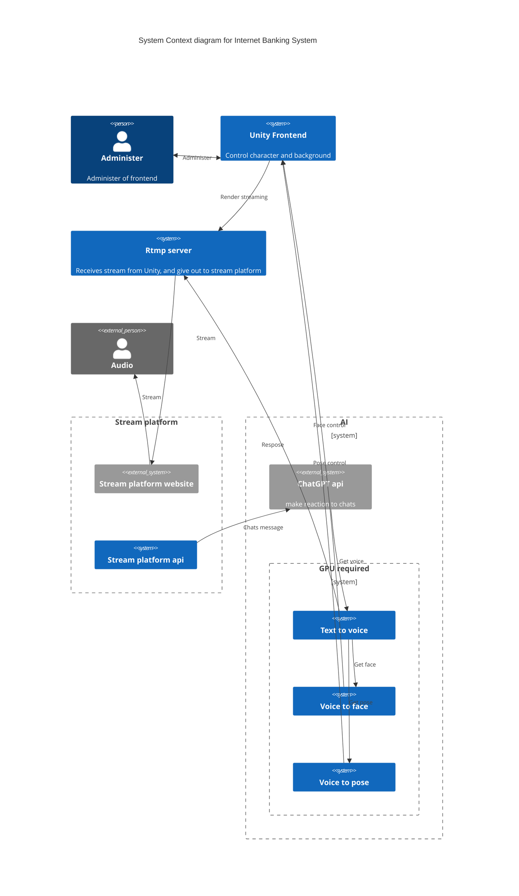

# Virtual-AI-Streamer

```mermaid
C4Context
title System Context diagram for Internet Banking System

Person(Administer, "Administer", "Administer of frontend")


System(Unity, "Unity Frontend", "Control character and background")
System(Rtmp, "Rtmp server", "Receives stream from Unity, and give out to stream platform")

Person_Ext(Audio, "Audio")
Boundary(b1, "Stream platform", ""){
  System_Ext(SystemCC, "Stream platform website")
  System(SystemDD, "Stream platform api")
}

BiRel(Administer, Unity, "Administer")
UpdateRelStyle(Administer, Unity, $offsetX="-30")

Rel(Unity, Rtmp, "Render streaming")
UpdateRelStyle(Unity, Rtmp, $offsetX="-50")

Rel(Rtmp, SystemCC, "Stream")
UpdateRelStyle(Rtmp, SystemCC, $offsetX="70", $offsetY="-70")

Rel(SystemCC, Audio, "Stream")
UpdateRelStyle(SystemCC, Audio, $offsetY="-50")

Boundary(b2, "AI") {

  System_Ext(SystemE, "ChatGPT api", "make reaction to chats")

  Boundary(b3, "GPU required") {
    System(SystemF, "Text to voice")
    System(SystemG, "Voice to face")
    System(SystemH, "Voice to pose")
  }
}


Rel(SystemDD, SystemE, "Chats message")
Rel(SystemE, SystemF, "Get voice")
Rel(SystemF, Rtmp, "Respose")
Rel(SystemF, SystemG, "Get face")
Rel(SystemF, SystemH, "Get pose")

Rel(SystemG, Unity, "Face control")
Rel(SystemH, Unity, "Pose control")
```
