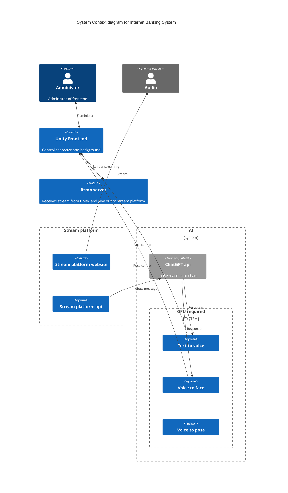

# Virtual-AI-Streamer

```mermaid
C4Context
title System Context diagram for Internet Banking System

Person(Administer, "Administer", "Administer of frontend")
Person_Ext(Audio, "Audio")

System(Unity, "Unity Frontend", "Control character and background")
System(Rtmp, "Rtmp server", "Receives stream from Unity, and give out to stream platform")
Boundary(b1, "Stream platform", ""){
  System(SystemCC, "Stream platform website")
  System(SystemDD, "Stream platform api")
}

BiRel(Administer, Unity, "Administer")

Rel(Unity, Rtmp, "Render streaming")

Rel(SystemCC, Audio, "Stream")

Boundary(b2, "AI") {

  System_Ext(SystemE, "ChatGPT api", "make reaction to chats")

  System_Boundary(b3, "GPU required") {
    System(SystemF, "Text to voice")
    System(SystemG, "Voice to face")
    System(SystemH, "Voice to pose")
  }
}


Rel(SystemDD, SystemE, "Chats message")
Rel(SystemE, SystemF, "Response")
Rel(SystemE, SystemG, "Response")

Rel(SystemF, Unity, "Face control")
Rel(SystemG, Unity, "Pose control")
```
